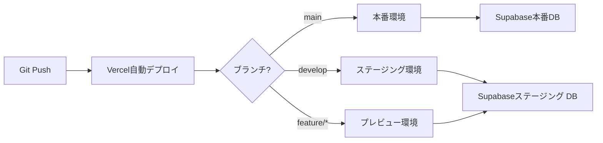

# LINEミニアプリ「クーポン機能」プロトタイプ 詳細仕様書

> **デザインコンセプト：ビームス株式会社のブランドイメージ**  
> 洗練された都会的なデザイン × BEAMSオレンジ (#FF6600) のアクセントカラー

```
┌─────────────────────────────────────────────────────────┐
│  🎨 BEAMS風デザイン要素                                  │
├─────────────────────────────────────────────────────────┤
│  • メインカラー： BEAMSオレンジ (#FF6600)                │
│  • フォント： Inter + Noto Sans JP                       │
│  • スタイル： ミニマル、クリーン、モダン                  │
│  • 余白： ホワイトスペースを活かしたレイアウト             │
│  • シャドウ： 控えめで洗練された影                       │
│  • アニメーション： 滑らかで自然な動き (200ms標準)       │
└─────────────────────────────────────────────────────────┘
```

**📱 主要画面プレビュー:**
- **ミニアプリ:** クリーンな白背景に BEAMSオレンジのアクセント、カード型UI
- **管理画面:** ダッシュボード形式、リアルタイム更新表示、統計カード

---

## 0. クーポン例（アパレル向け）

本システムで発行されるクーポンは、**BEAMSアパレルストア向け**を想定しています。

### 典型的なクーポン例

| クーポン名 | 説明 | 利用シーン |
|----------|------|----------|
| **全品10%OFF** | 店内全商品が10%割引 | 季節の変わり目セール |
| **2点目半額** | 2点以上購入で2点目が50%OFF | まとめ買い促進 |
| **3,000円OFF** | 10,000円以上の購入で3,000円割引 | 高額商品購入促進 |
| **送料無料** | オンラインストア送料無料 | オンライン購入促進 |
| **オリジナルトートバッグプレゼント** | 購入者全員にノベルティ進呈 | 新規顧客獲得 |
| **会員限定20%OFF** | LINE友だち限定の特別割引 | ロイヤリティ向上 |
| **秋冬コレクション先行販売** | 新作の先行購入権 | VIP顧客向け |

---

## 1. システムアーキテクチャ

### 1.1 全体構成図

```
┌─────────────────┐         ┌─────────────────┐
│  LINE Platform  │         │  管理者PC       │
│   (LIFF SDK)    │         │                 │
└────────┬────────┘         └────────┬────────┘
         │                           │
         │ HTTPS                     │ HTTPS
         │                           │
    ┌────▼───────────────────────────▼─────┐
    │         Vercel (Next.js)              │
    │  ┌──────────────┐  ┌──────────────┐  │
    │  │  Mini App    │  │  Admin App   │  │
    │  │  (/mini)     │  │  (/admin)    │  │
    │  └──────────────┘  └──────────────┘  │
    └────────────────┬──────────────────────┘
                     │
                     │ REST API / Realtime
                     │
            ┌────────▼──────────┐
            │    Supabase       │
            │  ┌─────────────┐  │
            │  │ PostgreSQL  │  │
            │  │   + RLS     │  │
            │  └─────────────┘  │
            │  ┌─────────────┐  │
            │  │   Storage   │  │
            │  └─────────────┘  │
            │  ┌─────────────┐  │
            │  │  Realtime   │  │
            │  └─────────────┘  │
            └───────────────────┘
```

### 1.2 技術スタック詳細

| レイヤー | 技術 | バージョン | 用途 |
|---------|------|-----------|------|
| Frontend Framework | Next.js | 14.x (App Router) | サーバーコンポーネント・クライアントコンポーネント |
| UI Library | React | 18.x | UI構築 |
| スタイリング | Tailwind CSS | 3.x | レスポンシブデザイン |
| アニメーション | Framer Motion | 11.x | もぎりアニメーション |
| LINE SDK | LIFF SDK | 2.24.x | LINE認証・プロフィール取得 |
| バックエンド | Supabase | Latest | データベース・認証・ストレージ |
| ホスティング | Vercel | Latest | デプロイ・環境変数管理 |
| フォント | Inter, Noto Sans JP | Google Fonts | 高い可読性とモダンな印象 |

---

## 2. デザインシステム（BEAMS風）

### 2.1 デザインコンセプト

**ビームス株式会社のブランドイメージを踏襲:**
- **洗練された都会的な雰囲気** - クリーンでモダンなインターフェース
- **親しみやすさと高級感の両立** - カジュアルでありながら上質な体験
- **シンプルで直感的** - 余白を活かした見やすいレイアウト
- **エネルギッシュなアクセントカラー** - BEAMSオレンジを効果的に使用

### 2.2 カラーパレット

#### プライマリカラー（BEAMSオレンジ）

```css
/* Tailwind Config */
colors: {
  beams: {
    50: '#FFF5EB',   /* 最も薄いオレンジ - 背景用 */
    100: '#FFE8D1',  /* 薄いオレンジ - ホバー背景 */
    200: '#FFD1A3',  /* ライトオレンジ */
    300: '#FFB875',  /* ミディアムオレンジ */
    400: '#FF9F47',  /* オレンジ */
    500: '#FF6600',  /* メインオレンジ（BEAMSコーポレートカラー） */
    600: '#E65C00',  /* 濃いオレンジ */
    700: '#B84800',  /* ダークオレンジ */
    800: '#8A3600',  /* 最も濃いオレンジ */
    900: '#5C2400',  /* ディープオレンジ */
  }
}
```

**使用用途:**
- `beams-500`: メインCTA、アクティブ状態、重要なアイコン
- `beams-50`: 背景のアクセント、カード背景
- `beams-600`: ボタンホバー、プレス状態
- `beams-100`: 選択状態の背景

#### セカンダリカラー（グレースケール）

```css
colors: {
  neutral: {
    50: '#FAFAFA',   /* 背景 */
    100: '#F5F5F5',  /* カード背景 */
    200: '#E5E5E5',  /* ボーダー */
    300: '#D4D4D4',  /* 無効状態 */
    400: '#A3A3A3',  /* プレースホルダー */
    500: '#737373',  /* セカンダリテキスト */
    600: '#525252',  /* ボディテキスト */
    700: '#404040',  /* 見出し */
    800: '#262626',  /* タイトル */
    900: '#171717',  /* メインテキスト */
  }
}
```

#### アクセントカラー

```css
colors: {
  success: '#10B981',  /* 成功・完了 */
  warning: '#F59E0B',  /* 警告 */
  error: '#EF4444',    /* エラー */
  info: '#3B82F6',     /* 情報 */
}
```

#### カラー使用例

| 要素 | カラー | 説明 |
|-----|-------|------|
| メインCTAボタン | `bg-beams-500 hover:bg-beams-600` | クーポン使用ボタンなど |
| セカンダリボタン | `bg-neutral-100 hover:bg-neutral-200 text-neutral-900` | キャンセルボタンなど |
| リンク | `text-beams-500 hover:text-beams-600` | テキストリンク |
| 見出し | `text-neutral-900` | ページタイトル |
| 本文 | `text-neutral-700` | 説明文 |
| 補足テキスト | `text-neutral-500` | 注意書き、日付など |
| ボーダー | `border-neutral-200` | カード、入力欄 |
| 背景 | `bg-neutral-50` | ページ背景 |
| カード背景 | `bg-white` | コンテンツカード |
| アクセント背景 | `bg-beams-50` | 強調エリア |

### 2.3 タイポグラフィ

#### フォントファミリー

```css
fontFamily: {
  sans: ['Inter', 'Noto Sans JP', 'sans-serif'],
  heading: ['Inter', 'Noto Sans JP', 'sans-serif'],
}
```

#### フォントサケール

| 用途 | サイズ | Line Height | Font Weight | Tailwind Class |
|-----|-------|-------------|-------------|----------------|
| H1 - ページタイトル | 32px (2rem) | 1.2 | 700 (Bold) | `text-3xl font-bold` |
| H2 - セクション見出し | 24px (1.5rem) | 1.3 | 700 (Bold) | `text-2xl font-bold` |
| H3 - サブ見出し | 20px (1.25rem) | 1.4 | 600 (SemiBold) | `text-xl font-semibold` |
| Body - 本文 | 16px (1rem) | 1.6 | 400 (Regular) | `text-base` |
| Small - 補足 | 14px (0.875rem) | 1.5 | 400 (Regular) | `text-sm` |
| Caption - キャプション | 12px (0.75rem) | 1.4 | 400 (Regular) | `text-xs` |
| Button - ボタン | 16px (1rem) | 1.5 | 600 (SemiBold) | `text-base font-semibold` |

#### テキストスタイル例

```tsx
// 見出し1（ページタイトル）
<h1 className="text-3xl font-bold text-neutral-900">
  クーポン一覧
</h1>

// 見出し2（セクション）
<h2 className="text-2xl font-bold text-neutral-800">
  利用可能なクーポン
</h2>

// 本文
<p className="text-base text-neutral-700 leading-relaxed">
  全てのドリンクメニューから1杯お選びいただけます
</p>

// 補足テキスト
<span className="text-sm text-neutral-500">
  有効期限: 2025年12月31日まで
</span>
```

### 2.4 スペーシング

```css
spacing: {
  xs: '4px',    /* 0.25rem */
  sm: '8px',    /* 0.5rem */
  md: '16px',   /* 1rem */
  lg: '24px',   /* 1.5rem */
  xl: '32px',   /* 2rem */
  '2xl': '48px', /* 3rem */
  '3xl': '64px', /* 4rem */
}
```

**使用ガイドライン:**
- コンポーネント内の要素間: `gap-md (16px)`
- セクション間: `gap-xl (32px)`
- ページの上下余白: `py-xl (32px)`
- カードのパディング: `p-lg (24px)`
- ボタンのパディング: `px-lg py-md (24px 16px)`

### 2.5 シャドウ・エレベーション

```css
boxShadow: {
  sm: '0 1px 2px 0 rgba(0, 0, 0, 0.05)',           /* 軽い影 */
  DEFAULT: '0 2px 8px 0 rgba(0, 0, 0, 0.08)',      /* 標準 */
  md: '0 4px 16px 0 rgba(0, 0, 0, 0.1)',           /* カード */
  lg: '0 8px 24px 0 rgba(0, 0, 0, 0.12)',          /* モーダル */
  xl: '0 12px 32px 0 rgba(0, 0, 0, 0.15)',         /* ドロップダウン */
  beams: '0 4px 16px 0 rgba(255, 102, 0, 0.15)',   /* オレンジ影 */
}
```

**使用例:**
- クーポンカード: `shadow-md hover:shadow-lg`
- モーダル: `shadow-xl`
- メインCTAボタン: `shadow-beams`
- ドロップダウン: `shadow-xl`

### 2.6 ボーダー・角丸

```css
borderRadius: {
  sm: '4px',   /* 小さな要素 */
  DEFAULT: '8px',   /* 標準 */
  md: '12px',  /* カード */
  lg: '16px',  /* 大きなカード */
  xl: '24px',  /* モーダル */
  full: '9999px', /* 円形 */
}
```

### 2.7 UIコンポーネントスタイル定義

#### プライマリボタン（メインアクション）

```tsx
<button className="
  w-full
  bg-beams-500 
  hover:bg-beams-600 
  active:bg-beams-700
  text-white 
  font-semibold 
  text-base
  px-6 
  py-4
  rounded-lg
  shadow-beams
  hover:shadow-lg
  transition-all 
  duration-200
  disabled:bg-neutral-300
  disabled:cursor-not-allowed
  disabled:shadow-none
">
  クーポンを利用する
</button>
```

#### セカンダリボタン

```tsx
<button className="
  w-full
  bg-white
  hover:bg-neutral-50
  active:bg-neutral-100
  text-neutral-900
  font-semibold
  text-base
  px-6
  py-4
  rounded-lg
  border-2
  border-neutral-200
  hover:border-neutral-300
  transition-all
  duration-200
">
  キャンセル
</button>
```

#### クーポンカード

```tsx
<div className="
  bg-white
  rounded-lg
  shadow-md
  hover:shadow-lg
  transition-all
  duration-200
  overflow-hidden
  border
  border-neutral-100
  hover:border-beams-200
  cursor-pointer
">
  {/* カード内容 */}
</div>
```

#### 入力フィールド

```tsx
<input className="
  w-full
  px-4
  py-3
  text-base
  text-neutral-900
  placeholder-neutral-400
  bg-white
  border
  border-neutral-200
  rounded-lg
  focus:outline-none
  focus:ring-2
  focus:ring-beams-500
  focus:border-transparent
  transition-all
  duration-200
" />
```

#### バッジ（ステータス表示）

```tsx
{/* 使用可能 */}
<span className="
  inline-flex
  items-center
  px-3
  py-1
  rounded-full
  text-xs
  font-semibold
  bg-beams-50
  text-beams-700
  border
  border-beams-200
">
  利用可能
</span>

{/* 使用済み */}
<span className="
  inline-flex
  items-center
  px-3
  py-1
  rounded-full
  text-xs
  font-semibold
  bg-neutral-100
  text-neutral-600
  border
  border-neutral-200
">
  使用済み
</span>
```

### 2.8 アイコンシステム

**アイコンライブラリ:** Lucide React (軽量でモダン)

```bash
npm install lucide-react
```

**使用例:**
```tsx
import { Ticket, Calendar, Info, Check, X, Menu, ChevronRight } from 'lucide-react';

// メインアクション
<Ticket className="w-5 h-5 text-beams-500" />

// 情報表示
<Calendar className="w-4 h-4 text-neutral-500" />
```

### 2.9 アニメーション

#### トランジション設定

```css
transition: {
  fast: '150ms cubic-bezier(0.4, 0, 0.2, 1)',
  DEFAULT: '200ms cubic-bezier(0.4, 0, 0.2, 1)',
  slow: '300ms cubic-bezier(0.4, 0, 0.2, 1)',
}
```

#### アニメーション原則

1. **控えめに**: 過度なアニメーションは避け、意味のある場所にのみ使用
2. **高速に**: 200ms以内の短いアニメーションを基本とする
3. **自然に**: イージング関数で滑らかな動きを実現
4. **フィードバック**: ユーザーアクションに対して即座に反応

### 2.10 Tailwind CSS 設定ファイル（完全版）

```typescript
// tailwind.config.ts
import type { Config } from 'tailwindcss';

const config: Config = {
  content: [
    './pages/**/*.{js,ts,jsx,tsx,mdx}',
    './components/**/*.{js,ts,jsx,tsx,mdx}',
    './app/**/*.{js,ts,jsx,tsx,mdx}',
  ],
  theme: {
    extend: {
      colors: {
        // BEAMSブランドカラー
        beams: {
          50: '#FFF5EB',
          100: '#FFE8D1',
          200: '#FFD1A3',
          300: '#FFB875',
          400: '#FF9F47',
          500: '#FF6600',  // メインカラー
          600: '#E65C00',
          700: '#B84800',
          800: '#8A3600',
          900: '#5C2400',
        },
        // グレースケール
        neutral: {
          50: '#FAFAFA',
          100: '#F5F5F5',
          200: '#E5E5E5',
          300: '#D4D4D4',
          400: '#A3A3A3',
          500: '#737373',
          600: '#525252',
          700: '#404040',
          800: '#262626',
          900: '#171717',
        },
      },
      fontFamily: {
        sans: ['Inter', 'Noto Sans JP', 'sans-serif'],
        heading: ['Inter', 'Noto Sans JP', 'sans-serif'],
      },
      fontSize: {
        '3xl': ['32px', { lineHeight: '1.2', fontWeight: '700' }],
        '2xl': ['24px', { lineHeight: '1.3', fontWeight: '700' }],
        'xl': ['20px', { lineHeight: '1.4', fontWeight: '600' }],
        'base': ['16px', { lineHeight: '1.6', fontWeight: '400' }],
        'sm': ['14px', { lineHeight: '1.5', fontWeight: '400' }],
        'xs': ['12px', { lineHeight: '1.4', fontWeight: '400' }],
      },
      spacing: {
        'xs': '4px',
        'sm': '8px',
        'md': '16px',
        'lg': '24px',
        'xl': '32px',
        '2xl': '48px',
        '3xl': '64px',
      },
      boxShadow: {
        'sm': '0 1px 2px 0 rgba(0, 0, 0, 0.05)',
        'DEFAULT': '0 2px 8px 0 rgba(0, 0, 0, 0.08)',
        'md': '0 4px 16px 0 rgba(0, 0, 0, 0.1)',
        'lg': '0 8px 24px 0 rgba(0, 0, 0, 0.12)',
        'xl': '0 12px 32px 0 rgba(0, 0, 0, 0.15)',
        'beams': '0 4px 16px 0 rgba(255, 102, 0, 0.15)',
      },
      borderRadius: {
        'sm': '4px',
        'DEFAULT': '8px',
        'md': '12px',
        'lg': '16px',
        'xl': '24px',
        'full': '9999px',
      },
      transitionDuration: {
        'fast': '150ms',
        'DEFAULT': '200ms',
        'slow': '300ms',
      },
      transitionTimingFunction: {
        'DEFAULT': 'cubic-bezier(0.4, 0, 0.2, 1)',
      },
      keyframes: {
        'fade-in': {
          '0%': { opacity: '0' },
          '100%': { opacity: '1' },
        },
        'slide-up': {
          '0%': { transform: 'translateY(20px)', opacity: '0' },
          '100%': { transform: 'translateY(0)', opacity: '1' },
        },
        'scale-in': {
          '0%': { transform: 'scale(0.95)', opacity: '0' },
          '100%': { transform: 'scale(1)', opacity: '1' },
        },
      },
      animation: {
        'fade-in': 'fade-in 0.2s ease-out',
        'slide-up': 'slide-up 0.3s ease-out',
        'scale-in': 'scale-in 0.2s ease-out',
      },
    },
  },
  plugins: [],
};

export default config;
```

### 2.11 グローバルスタイル

```css
/* app/globals.css */
@tailwind base;
@tailwind components;
@tailwind utilities;

@layer base {
  /* フォントのインポート */
  @import url('https://fonts.googleapis.com/css2?family=Inter:wght@400;600;700&family=Noto+Sans+JP:wght@400;600;700&display=swap');

  /* ベーススタイル */
  html {
    @apply antialiased;
    -webkit-font-smoothing: antialiased;
    -moz-osx-font-smoothing: grayscale;
  }

  body {
    @apply bg-neutral-50 text-neutral-900 font-sans;
  }

  /* スクロールバーのスタイリング */
  ::-webkit-scrollbar {
    width: 8px;
    height: 8px;
  }

  ::-webkit-scrollbar-track {
    @apply bg-neutral-100;
  }

  ::-webkit-scrollbar-thumb {
    @apply bg-neutral-300 rounded-full hover:bg-neutral-400;
  }
}

@layer components {
  /* プライマリボタン */
  .btn-primary {
    @apply w-full bg-beams-500 hover:bg-beams-600 active:bg-beams-700
           text-white font-semibold text-base
           px-6 py-4 rounded-lg
           shadow-beams hover:shadow-lg
           transition-all duration-200
           disabled:bg-neutral-300 disabled:cursor-not-allowed disabled:shadow-none;
  }

  /* セカンダリボタン */
  .btn-secondary {
    @apply w-full bg-white hover:bg-neutral-50 active:bg-neutral-100
           text-neutral-900 font-semibold text-base
           px-6 py-4 rounded-lg
           border-2 border-neutral-200 hover:border-neutral-300
           transition-all duration-200;
  }

  /* カード */
  .card {
    @apply bg-white rounded-lg shadow-md border border-neutral-100
           hover:shadow-lg transition-all duration-200;
  }

  /* 入力フィールド */
  .input {
    @apply w-full px-4 py-3 text-base text-neutral-900
           placeholder-neutral-400 bg-white
           border border-neutral-200 rounded-lg
           focus:outline-none focus:ring-2 focus:ring-beams-500 focus:border-transparent
           transition-all duration-200;
  }

  /* バッジ */
  .badge-primary {
    @apply inline-flex items-center px-3 py-1 rounded-full
           text-xs font-semibold
           bg-beams-50 text-beams-700 border border-beams-200;
  }

  .badge-secondary {
    @apply inline-flex items-center px-3 py-1 rounded-full
           text-xs font-semibold
           bg-neutral-100 text-neutral-600 border border-neutral-200;
  }
}

@layer utilities {
  /* カスタムユーティリティ */
  .text-gradient-beams {
    @apply bg-gradient-to-r from-beams-500 to-beams-600 bg-clip-text text-transparent;
  }

  .bg-gradient-beams {
    @apply bg-gradient-to-br from-beams-400 to-beams-600;
  }
}
```

---

## 3. データベース詳細仕様

## 2. データベース詳細仕様

### 2.1 テーブル定義（SQL DDL）

#### coupons テーブル

```sql
CREATE TABLE coupons (
  id UUID PRIMARY KEY DEFAULT gen_random_uuid(),
  title TEXT NOT NULL,  -- 例: '全品10%OFF', '2点目半額', '3,000円OFF'
  description TEXT,     -- 詳細説明、対象外商品の記載など
  image_url TEXT,       -- アパレル商品のビジュアル画像URL
  valid_from TIMESTAMPTZ NOT NULL,
  valid_to TIMESTAMPTZ NOT NULL,
  is_active BOOLEAN DEFAULT true,
  usage_limit INTEGER DEFAULT 1,  -- 1回のみ or 無制限
  created_at TIMESTAMPTZ DEFAULT NOW(),
  updated_at TIMESTAMPTZ DEFAULT NOW()
);

-- インデックス
CREATE INDEX idx_coupons_active ON coupons(is_active);
CREATE INDEX idx_coupons_validity ON coupons(valid_from, valid_to);

-- 更新日時の自動更新トリガー
CREATE OR REPLACE FUNCTION update_updated_at_column()
RETURNS TRIGGER AS $$
BEGIN
    NEW.updated_at = NOW();
    RETURN NEW;
END;
$$ language 'plpgsql';

CREATE TRIGGER update_coupons_updated_at BEFORE UPDATE ON coupons
FOR EACH ROW EXECUTE FUNCTION update_updated_at_column();
```

#### users テーブル

```sql
CREATE TABLE users (
  id TEXT PRIMARY KEY, -- LINE User ID (sub)
  display_name TEXT,
  avatar_url TEXT,
  created_at TIMESTAMPTZ DEFAULT NOW(),
  last_login_at TIMESTAMPTZ DEFAULT NOW()
);

-- インデックス
CREATE INDEX idx_users_created_at ON users(created_at DESC);
```

#### user_coupons テーブル

```sql
CREATE TABLE user_coupons (
  id UUID PRIMARY KEY DEFAULT gen_random_uuid(),
  user_id TEXT NOT NULL REFERENCES users(id) ON DELETE CASCADE,
  coupon_id UUID NOT NULL REFERENCES coupons(id) ON DELETE CASCADE,
  used_at TIMESTAMPTZ,
  status TEXT NOT NULL DEFAULT 'unused' CHECK (status IN ('used', 'unused')),
  created_at TIMESTAMPTZ DEFAULT NOW(),
  UNIQUE(user_id, coupon_id, created_at)
);

-- インデックス
CREATE INDEX idx_user_coupons_user_id ON user_coupons(user_id);
CREATE INDEX idx_user_coupons_coupon_id ON user_coupons(coupon_id);
CREATE INDEX idx_user_coupons_status ON user_coupons(status);
CREATE INDEX idx_user_coupons_used_at ON user_coupons(used_at DESC);
```

### 2.2 RLS（Row Level Security）ポリシー

#### coupons テーブルのRLS

```sql
-- RLSを有効化
ALTER TABLE coupons ENABLE ROW LEVEL SECURITY;

-- 誰でも有効なクーポンを閲覧可能
CREATE POLICY "Anyone can view active coupons"
ON coupons FOR SELECT
USING (is_active = true);

-- 管理者のみ全てのクーポンを閲覧可能
CREATE POLICY "Admins can view all coupons"
ON coupons FOR SELECT
TO authenticated
USING (
  auth.jwt() ->> 'email' IN (
    SELECT email FROM auth.users WHERE email LIKE '%@admin.example.com'
  )
);

-- 管理者のみクーポンを作成・更新・削除可能
CREATE POLICY "Admins can insert coupons"
ON coupons FOR INSERT
TO authenticated
WITH CHECK (
  auth.jwt() ->> 'email' IN (
    SELECT email FROM auth.users WHERE email LIKE '%@admin.example.com'
  )
);

CREATE POLICY "Admins can update coupons"
ON coupons FOR UPDATE
TO authenticated
USING (
  auth.jwt() ->> 'email' IN (
    SELECT email FROM auth.users WHERE email LIKE '%@admin.example.com'
  )
);

CREATE POLICY "Admins can delete coupons"
ON coupons FOR DELETE
TO authenticated
USING (
  auth.jwt() ->> 'email' IN (
    SELECT email FROM auth.users WHERE email LIKE '%@admin.example.com'
  )
);
```

#### users テーブルのRLS

```sql
ALTER TABLE users ENABLE ROW LEVEL SECURITY;

-- ユーザーは自分の情報のみ閲覧・作成・更新可能
CREATE POLICY "Users can view own profile"
ON users FOR SELECT
USING (true); -- LINEユーザーIDベースなので全て許可（APIレベルで制御）

CREATE POLICY "Users can insert own profile"
ON users FOR INSERT
WITH CHECK (true);

CREATE POLICY "Users can update own profile"
ON users FOR UPDATE
USING (true);
```

#### user_coupons テーブルのRLS

```sql
ALTER TABLE user_coupons ENABLE ROW LEVEL SECURITY;

-- ユーザーは自分の使用履歴のみ閲覧可能
CREATE POLICY "Users can view own coupons"
ON user_coupons FOR SELECT
USING (true);

-- ユーザーは自分のクーポン使用のみ記録可能
CREATE POLICY "Users can insert own coupon usage"
ON user_coupons FOR INSERT
WITH CHECK (true);

-- 管理者は全ての履歴を閲覧可能
CREATE POLICY "Admins can view all coupon usage"
ON user_coupons FOR SELECT
TO authenticated
USING (
  auth.jwt() ->> 'email' IN (
    SELECT email FROM auth.users WHERE email LIKE '%@admin.example.com'
  )
);
```

### 2.3 Realtime設定

```sql
-- Realtimeを有効化
ALTER PUBLICATION supabase_realtime ADD TABLE user_coupons;
```

---

## 3. API仕様

### 3.1 エンドポイント一覧

#### ユーザー側API（ミニアプリ用）

| エンドポイント | メソッド | 説明 | 認証 |
|------------|---------|------|-----|
| `/api/mini/auth/register` | POST | ユーザー登録・ログイン | LIFF Token |
| `/api/mini/coupons` | GET | 有効なクーポン一覧取得 | LIFF Token |
| `/api/mini/coupons/:id` | GET | クーポン詳細取得 | LIFF Token |
| `/api/mini/coupons/:id/use` | POST | クーポン使用（もぎり） | LIFF Token |
| `/api/mini/user/coupons` | GET | 自分の使用履歴取得 | LIFF Token |

#### 管理者側API（管理画面用）

| エンドポイント | メソッド | 説明 | 認証 |
|------------|---------|------|-----|
| `/api/admin/auth/login` | POST | 管理者ログイン | Email/Password |
| `/api/admin/coupons` | GET | 全クーポン一覧取得 | Supabase Auth |
| `/api/admin/coupons` | POST | クーポン作成 | Supabase Auth |
| `/api/admin/coupons/:id` | PUT | クーポン更新 | Supabase Auth |
| `/api/admin/coupons/:id` | DELETE | クーポン削除 | Supabase Auth |
| `/api/admin/coupons/:id/upload-image` | POST | クーポン画像アップロード | Supabase Auth |
| `/api/admin/usage-logs` | GET | 使用履歴一覧取得 | Supabase Auth |

### 3.2 API詳細仕様

#### 3.2.1 ユーザー登録・ログイン

**エンドポイント:** `POST /api/mini/auth/register`

**リクエストヘッダー:**
```json
{
  "Authorization": "Bearer {LIFF_ID_TOKEN}"
}
```

**リクエストボディ:**
```json
{
  "lineUserId": "U1234567890abcdef",
  "displayName": "山田太郎",
  "avatarUrl": "https://profile.line-scdn.net/..."
}
```

**レスポンス (200 OK):**
```json
{
  "success": true,
  "user": {
    "id": "U1234567890abcdef",
    "displayName": "山田太郎",
    "avatarUrl": "https://profile.line-scdn.net/...",
    "createdAt": "2025-12-03T10:00:00Z"
  },
  "isNewUser": false
}
```

#### 3.2.2 クーポン一覧取得

**エンドポイント:** `GET /api/mini/coupons`

**クエリパラメータ:**
- `userId`: LINE User ID (必須)
- `includeUsed`: 使用済みを含むか (デフォルト: false)

**レスポンス (200 OK):**
```json
{
  "success": true,
  "coupons": [
    {
      "id": "uuid-1234",
      "title": "全品10%OFF",
      "description": "店内全商品が10%割引でお買い求めいただけます",
      "imageUrl": "https://supabase.co/storage/v1/...",
      "validFrom": "2025-12-01T00:00:00Z",
      "validTo": "2025-12-31T23:59:59Z",
      "usageLimit": 1,
      "userStatus": {
        "isUsed": false,
        "usedCount": 0,
        "canUse": true
      }
    }
  ]
}
```

#### 3.2.3 クーポン使用（もぎり）

**エンドポイント:** `POST /api/mini/coupons/:id/use`

**リクエストヘッダー:**
```json
{
  "Authorization": "Bearer {LIFF_ID_TOKEN}"
}
```

**リクエストボディ:**
```json
{
  "userId": "U1234567890abcdef",
  "confirmUsage": true
}
```

**レスポンス (200 OK):**
```json
{
  "success": true,
  "userCoupon": {
    "id": "uuid-5678",
    "userId": "U1234567890abcdef",
    "couponId": "uuid-1234",
    "usedAt": "2025-12-03T15:30:00Z",
    "status": "used"
  },
  "message": "クーポンを使用しました"
}
```

**エラーレスポンス (400 Bad Request):**
```json
{
  "success": false,
  "error": "ALREADY_USED",
  "message": "このクーポンは既に使用済みです"
}
```

```json
{
  "success": false,
  "error": "EXPIRED",
  "message": "このクーポンは有効期限切れです"
}
```

```json
{
  "success": false,
  "error": "USAGE_LIMIT_EXCEEDED",
  "message": "利用回数の上限に達しています"
}
```

#### 3.2.4 クーポン作成（管理者）

**エンドポイント:** `POST /api/admin/coupons`

**リクエストボディ:**
```json
{
  "title": "全品10%OFF",
  "description": "店内全商品が10%割引でお買い求めいただけます。一部商品を除く。",
  "validFrom": "2025-12-01T00:00:00Z",
  "validTo": "2025-12-31T23:59:59Z",
  "usageLimit": 1,
  "isActive": true
}
```

**レスポンス (201 Created):**
```json
{
  "success": true,
  "coupon": {
    "id": "uuid-1234",
    "title": "全品10%OFF",
    "description": "店内全商品が10%割引でお買い求めいただけます。一部商品を除く。",
    "imageUrl": null,
    "validFrom": "2025-12-01T00:00:00Z",
    "validTo": "2025-12-31T23:59:59Z",
    "usageLimit": 1,
    "isActive": true,
    "createdAt": "2025-12-03T10:00:00Z"
  }
}
```

#### 3.2.5 画像アップロード

**エンドポイント:** `POST /api/admin/coupons/:id/upload-image`

**リクエスト形式:** `multipart/form-data`

**フィールド:**
- `image`: 画像ファイル (JPEG, PNG, 最大5MB)

**レスポンス (200 OK):**
```json
{
  "success": true,
  "imageUrl": "https://supabase.co/storage/v1/object/public/coupons/uuid-1234.jpg"
}
```

#### 3.2.6 使用履歴一覧取得（管理者）

**エンドポイント:** `GET /api/admin/usage-logs`

**クエリパラメータ:**
- `limit`: 取得件数 (デフォルト: 50)
- `offset`: オフセット (デフォルト: 0)
- `couponId`: クーポンIDでフィルタ (オプション)
- `from`: 開始日時 (オプション)
- `to`: 終了日時 (オプション)

**レスポンス (200 OK):**
```json
{
  "success": true,
  "logs": [
    {
      "id": "uuid-5678",
      "user": {
        "id": "U1234567890abcdef",
        "displayName": "山田太郎",
        "avatarUrl": "https://profile.line-scdn.net/..."
      },
      "coupon": {
        "id": "uuid-1234",
        "title": "全品10%OFF"
      },
      "usedAt": "2025-12-03T15:30:00Z",
      "status": "used"
    }
  ],
  "total": 150,
  "limit": 50,
  "offset": 0
}
```

---

## 4. フロントエンド仕様

### 4.1 ディレクトリ構成

```
app/
├── (mini)/                    # ミニアプリ (LIFF)
│   ├── layout.tsx
│   ├── page.tsx              # クーポン一覧
│   ├── coupons/
│   │   └── [id]/
│   │       └── page.tsx      # クーポン詳細・もぎり画面
│   └── history/
│       └── page.tsx          # 使用履歴
├── (admin)/                   # 管理画面
│   ├── layout.tsx
│   ├── login/
│   │   └── page.tsx          # ログイン
│   ├── dashboard/
│   │   └── page.tsx          # ダッシュボード
│   ├── coupons/
│   │   ├── page.tsx          # クーポン一覧
│   │   ├── new/
│   │   │   └── page.tsx      # クーポン作成
│   │   └── [id]/
│   │       └── edit/
│   │           └── page.tsx  # クーポン編集
│   └── logs/
│       └── page.tsx          # 使用履歴
├── api/
│   ├── mini/                 # ミニアプリAPI
│   └── admin/                # 管理画面API
├── components/
│   ├── mini/                 # ミニアプリコンポーネント
│   │   ├── CouponCard.tsx
│   │   ├── CouponDetail.tsx
│   │   ├── MogiriModal.tsx
│   │   └── MogiriAnimation.tsx
│   └── admin/                # 管理画面コンポーネント
│       ├── CouponForm.tsx
│       ├── ImageUploader.tsx
│       ├── UsageLogTable.tsx
│       └── RealtimeIndicator.tsx
├── lib/
│   ├── supabase/
│   │   ├── client.ts         # Supabaseクライアント
│   │   └── server.ts         # サーバーサイド用
│   ├── liff/
│   │   └── client.ts         # LIFF初期化
│   └── utils/
│       ├── date.ts
│       └── validation.ts
└── types/
    ├── coupon.ts
    ├── user.ts
    └── api.ts
```

### 4.2 画面仕様

#### 4.2.1 ミニアプリ：クーポン一覧画面（BEAMS風デザイン）

**画面構成:**
```
┌───────────────────────────────────┐
│ ≡  クーポン              [Profile] │ ← bg-white, shadow-sm
├───────────────────────────────────┤
│                                   │ ← bg-neutral-50 (余白活用)
│   ┌─────────────────────────┐     │
│   │ 🎟️ 利用可能  📦 使用済み  │     │ ← タブ (BEAMSオレンジ下線)
│   └─────────────────────────┘     │
│                                   │
│   ┌─────────────────────────┐     │
│   │ ╔═══════════════════╗   │     │
│   │ ║                   ║   │     │ ← クーポン画像 (rounded-lg)
│   │ ║   10% OFF         ║   │     │   アパレル商品のビジュアル
│   │ ║                   ║   │     │
│   │ ╚═══════════════════╝   │     │
│   │                         │     │
│   │ 全品10%OFF              │     │ ← text-xl font-bold
│   │ 🎁 利用可能              │     │ ← beams-500 バッジ
│   │                         │     │
│   │ 📅 2025/12/31まで       │     │ ← text-sm text-neutral-500
│   │                         │     │
│   │ [詳しく見る →]          │     │ ← text-beams-500
│   └─────────────────────────┘     │ ← shadow-md, hover:shadow-lg
│                                   │   border border-neutral-100
│   ┌─────────────────────────┐     │   transition-all
│   │ ╔═══════════════════╗   │     │
│   │ ║                   ║   │     │
│   │ ║  2点目半額         ║   │     │ ← グレースケール + opacity-60
│   │ ║                   ║   │     │
│   │ ╚═══════════════════╝   │     │
│   │                         │     │
│   │ 2点目半額  ✓使用済み     │     │ ← neutral-600, 使用済みバッジ
│   │                         │     │
│   │ 📅 2025/12/20まで       │     │
│   │                         │     │
│   └─────────────────────────┘     │
│                                   │
└───────────────────────────────────┘
```

**デザイン実装（コンポーネント例）:**

```tsx
// components/mini/CouponCard.tsx
import { Calendar, Ticket, ChevronRight, Check } from 'lucide-react';
import { motion } from 'framer-motion';

export function CouponCard({ coupon, isUsed }: CouponCardProps) {
  return (
    <motion.div
      whileHover={{ scale: isUsed ? 1 : 1.02 }}
      whileTap={{ scale: 0.98 }}
      className={`
        bg-white rounded-lg shadow-md hover:shadow-lg 
        transition-all duration-200 overflow-hidden 
        border cursor-pointer
        ${isUsed 
          ? 'border-neutral-200 opacity-60' 
          : 'border-neutral-100 hover:border-beams-200'
        }
      `}
    >
      {/* クーポン画像 */}
      <div className="relative aspect-[16/9] overflow-hidden bg-gradient-to-br from-beams-50 to-beams-100">
        
        {/* 使用済みバッジ */}
        {isUsed && (
          <div className="absolute top-4 right-4 bg-neutral-900/80 backdrop-blur-sm px-3 py-1.5 rounded-full">
            <div className="flex items-center gap-1.5 text-white text-sm font-semibold">
              <Check className="w-4 h-4" />
              <span>使用済み</span>
            </div>
          </div>
        )}
      </div>

      {/* カード内容 */}
      <div className="p-5">
        {/* タイトル */}
        <h3 className="text-xl font-bold text-neutral-900 mb-2">
          {coupon.title}
        </h3>

        {/* ステータスバッジ */}
        {!isUsed && (
          <div className="inline-flex items-center gap-1.5 px-3 py-1 rounded-full bg-beams-50 border border-beams-200 mb-3">
            <Ticket className="w-3.5 h-3.5 text-beams-600" />
            <span className="text-xs font-semibold text-beams-700">利用可能</span>
          </div>
        )}

        {/* 有効期限 */}
        <div className="flex items-center gap-2 text-sm text-neutral-500 mb-4">
          <Calendar className="w-4 h-4" />
          <span>{formatDate(coupon.validTo)}まで</span>
        </div>

        {/* アクション */}
        <div className="flex items-center justify-between">
          <span className="text-sm text-beams-500 font-semibold">
            詳しく見る
          </span>
          <ChevronRight className="w-5 h-5 text-beams-500" />
        </div>
      </div>
    </motion.div>
  );
}
```

**タブ実装:**

```tsx
// components/mini/CouponTabs.tsx
export function CouponTabs({ activeTab, onChange }: CouponTabsProps) {
  return (
    <div className="flex gap-1 bg-neutral-100 p-1 rounded-lg">
      <button
        onClick={() => onChange('available')}
        className={`
          flex-1 flex items-center justify-center gap-2 
          py-2.5 px-4 rounded-md font-semibold text-sm
          transition-all duration-200
          ${activeTab === 'available'
            ? 'bg-white text-beams-600 shadow-sm'
            : 'text-neutral-600 hover:text-neutral-900'
          }
        `}
      >
        <Ticket className="w-4 h-4" />
        <span>利用可能</span>
      </button>
      
      <button
        onClick={() => onChange('used')}
        className={`
          flex-1 flex items-center justify-center gap-2 
          py-2.5 px-4 rounded-md font-semibold text-sm
          transition-all duration-200
          ${activeTab === 'used'
            ? 'bg-white text-beams-600 shadow-sm'
            : 'text-neutral-600 hover:text-neutral-900'
          }
        `}
      >
        <Check className="w-4 h-4" />
        <span>使用済み</span>
      </button>
    </div>
  );
}
```

**主要機能:**
- タブ切り替え（利用可能 / 使用済み）- BEAMSオレンジでアクティブ表示
- クーポンカードのタップで詳細画面へ遷移
- Pull to Refresh でデータ更新（BEAMSオレンジのローディングインジケーター）
- スケルトンローディング表示（シンプルでエレガント）
- ホバー・タップ時の滑らかなアニメーション

**状態管理:**
```typescript
interface CouponListState {
  coupons: Coupon[];
  loading: boolean;
  activeTab: 'available' | 'used';
  error: string | null;
}
```

#### 4.2.2 ミニアプリ：クーポン詳細・もぎり画面（BEAMS風デザイン）

**画面構成:**
```
┌───────────────────────────────────┐
│  ←  クーポン詳細          ⋯       │ ← bg-white, shadow-sm
├───────────────────────────────────┤
│                                   │ ← スクロール可能エリア
│   ┌───────────────────────────┐   │
│   │                           │   │
│   │    [BEAMS商品画像]         │   │ ← 16:9 アスペクト比
│   │   セーター、ジャケット等   │   │   rounded-xl overflow-hidden
│   │    10% OFFバッジ          │   │   アパレル商品のビジュアル
│   │                           │   │
│   └───────────────────────────┘   │
│                                   │
│   ┌─────────────────────────────┐ │
│   │ 🎁 利用可能                  │ │ ← beams-50 背景バッジ
│   └─────────────────────────────┘ │
│                                   │
│   全品10%OFF                      │ ← text-2xl font-bold
│                                   │   text-neutral-900
│   店内全商品が10%割引でお買い求め  │ ← text-base text-neutral-700
│   いただけます。一部商品を除く。   │   leading-relaxed
│                                   │
│   ┌─────────────────────────────┐ │
│   │ 📅 有効期限                  │ │ ← bg-neutral-50 rounded-lg
│   │ 2025年12月31日 23:59まで    │ │   p-4
│   └─────────────────────────────┘ │
│                                   │
│   ⚠️ ご利用上の注意               │ ← text-lg font-semibold
│                                   │
│   • 他のクーポンとの併用不可       │ ← text-sm text-neutral-600
│   • お会計前にスタッフへご提示     │   leading-relaxed
│   • 一部対象外商品がございます     │
│   • 1回限り有効                   │
│                                   │
└───────────────────────────────────┘
│  [🎫 クーポンを利用する]           │ ← 固定ボタン (bg-beams-500)
└───────────────────────────────────┘   shadow-beams
```

**デザイン実装（詳細画面）:**

```tsx
// app/(mini)/coupons/[id]/page.tsx
import { Calendar, AlertCircle, Ticket } from 'lucide-react';
import { motion } from 'framer-motion';

export default function CouponDetailPage({ params }: { params: { id: string } }) {
  return (
    <div className="min-h-screen bg-neutral-50">
      {/* ヘッダー */}
      <header className="sticky top-0 z-10 bg-white shadow-sm">
        <div className="flex items-center justify-between px-4 py-3">
          <button className="p-2 -ml-2 hover:bg-neutral-100 rounded-lg transition-colors">
            <ChevronLeft className="w-6 h-6 text-neutral-900" />
          </button>
          <h1 className="text-lg font-bold text-neutral-900">クーポン詳細</h1>
          <button className="p-2 -mr-2 hover:bg-neutral-100 rounded-lg transition-colors">
            <MoreVertical className="w-6 h-6 text-neutral-900" />
          </button>
        </div>
      </header>

      {/* メインコンテンツ */}
      <main className="pb-32">
        {/* クーポン画像 */}
        <div className="relative aspect-[16/9] overflow-hidden">
          <motion.img
            initial={{ scale: 1.1, opacity: 0 }}
            animate={{ scale: 1, opacity: 1 }}
            transition={{ duration: 0.5 }}
            src={coupon.imageUrl}
            alt={coupon.title}
            className="w-full h-full object-cover"
          />
          {/* グラデーションオーバーレイ */}
          <div className="absolute inset-0 bg-gradient-to-b from-transparent to-black/20" />
        </div>

        <div className="px-4 py-6 space-y-6">
          {/* ステータスバッジ */}
          <div className="inline-flex items-center gap-2 px-4 py-2 bg-beams-50 border-2 border-beams-200 rounded-full">
            <Ticket className="w-5 h-5 text-beams-600" />
            <span className="text-sm font-bold text-beams-700">利用可能</span>
          </div>

          {/* タイトル */}
          <motion.h2
            initial={{ y: 20, opacity: 0 }}
            animate={{ y: 0, opacity: 1 }}
            transition={{ delay: 0.2 }}
            className="text-3xl font-bold text-neutral-900 leading-tight"
          >
            {coupon.title}
          </motion.h2>

          {/* 説明文 */}
          <motion.p
            initial={{ y: 20, opacity: 0 }}
            animate={{ y: 0, opacity: 1 }}
            transition={{ delay: 0.3 }}
            className="text-base text-neutral-700 leading-relaxed"
          >
            店内全商品が10%割引でお買い求めいただけます。一部商品を除く。
          </motion.p>

          {/* 有効期限カード */}
          <motion.div
            initial={{ y: 20, opacity: 0 }}
            animate={{ y: 0, opacity: 1 }}
            transition={{ delay: 0.4 }}
            className="bg-neutral-50 rounded-xl p-5 border border-neutral-200"
          >
            <div className="flex items-start gap-3">
              <Calendar className="w-5 h-5 text-beams-500 mt-0.5 flex-shrink-0" />
              <div>
                <p className="text-sm font-semibold text-neutral-900 mb-1">有効期限</p>
                <p className="text-base text-neutral-700">
                  {formatDate(coupon.validTo)} 23:59まで
                </p>
              </div>
            </div>
          </motion.div>

          {/* 注意事項 */}
          <motion.div
            initial={{ y: 20, opacity: 0 }}
            animate={{ y: 0, opacity: 1 }}
            transition={{ delay: 0.5 }}
            className="space-y-3"
          >
            <div className="flex items-center gap-2">
              <AlertCircle className="w-5 h-5 text-neutral-600" />
              <h3 className="text-lg font-bold text-neutral-900">ご利用上の注意</h3>
            </div>
            <ul className="space-y-2 pl-7">
              <li className="text-sm text-neutral-600 leading-relaxed">
                • 他のクーポンとの併用はできません
              </li>
              <li className="text-sm text-neutral-600 leading-relaxed">
                • お会計前にスタッフへご提示ください
              </li>
              <li className="text-sm text-neutral-600 leading-relaxed">
                • 一部対象外商品がございます
              </li>
              <li className="text-sm text-neutral-600 leading-relaxed">
                • このクーポンは1回限り有効です
              </li>
            </ul>
          </motion.div>
        </div>
      </main>

      {/* 固定CTAボタン */}
      <div className="fixed bottom-0 left-0 right-0 bg-white border-t border-neutral-200 p-4 shadow-lg">
        <button
          onClick={() => setShowModal(true)}
          className="
            w-full flex items-center justify-center gap-2
            bg-beams-500 hover:bg-beams-600 active:bg-beams-700
            text-white font-bold text-lg
            px-6 py-4 rounded-xl
            shadow-beams hover:shadow-lg
            transition-all duration-200
            transform active:scale-98
          "
        >
          <Ticket className="w-6 h-6" />
          <span>クーポンを利用する</span>
        </button>
      </div>
    </div>
  );
}
```

**もぎりフロー（BEAMS風モーダル）:**

1. **確認モーダル**
```tsx
// components/mini/MogiriModal.tsx
export function MogiriModal({ isOpen, onClose, onConfirm }: MogiriModalProps) {
  return (
    <AnimatePresence>
      {isOpen && (
        <>
          {/* オーバーレイ */}
          <motion.div
            initial={{ opacity: 0 }}
            animate={{ opacity: 1 }}
            exit={{ opacity: 0 }}
            className="fixed inset-0 bg-black/50 backdrop-blur-sm z-40"
            onClick={onClose}
          />

          {/* モーダル */}
          <motion.div
            initial={{ opacity: 0, scale: 0.95, y: 20 }}
            animate={{ opacity: 1, scale: 1, y: 0 }}
            exit={{ opacity: 0, scale: 0.95, y: 20 }}
            className="fixed inset-x-4 top-1/2 -translate-y-1/2 z-50 max-w-sm mx-auto"
          >
            <div className="bg-white rounded-2xl shadow-xl overflow-hidden">
              {/* モーダルヘッダー */}
              <div className="bg-beams-50 px-6 py-5 border-b border-beams-100">
                <div className="flex items-center gap-3">
                  <div className="w-12 h-12 bg-beams-500 rounded-full flex items-center justify-center">
                    <Eye className="w-6 h-6 text-white" />
                  </div>
                  <div>
                    <h3 className="text-xl font-bold text-neutral-900">使用確認</h3>
                    <p className="text-sm text-neutral-600">スタッフに画面をお見せください</p>
                  </div>
                </div>
              </div>

              {/* モーダルボディ */}
              <div className="px-6 py-6 space-y-4">
                <p className="text-base text-neutral-700 leading-relaxed">
                  このクーポンを使用しますか？
                </p>
                
                <div className="bg-amber-50 border-2 border-amber-200 rounded-lg p-4">
                  <div className="flex items-start gap-3">
                    <AlertCircle className="w-5 h-5 text-amber-600 mt-0.5 flex-shrink-0" />
                    <p className="text-sm text-amber-800 font-medium">
                      一度使用すると元に戻せません
                    </p>
                  </div>
                </div>
              </div>

              {/* モーダルフッター */}
              <div className="px-4 pb-4 flex gap-3">
                <button
                  onClick={onClose}
                  className="
                    flex-1 px-6 py-3.5 rounded-xl
                    bg-white border-2 border-neutral-200
                    text-neutral-900 font-semibold text-base
                    hover:bg-neutral-50 active:bg-neutral-100
                    transition-all duration-200
                  "
                >
                  キャンセル
                </button>
                <button
                  onClick={onConfirm}
                  className="
                    flex-1 px-6 py-3.5 rounded-xl
                    bg-beams-500 hover:bg-beams-600 active:bg-beams-700
                    text-white font-bold text-base
                    shadow-beams
                    transition-all duration-200
                    transform active:scale-95
                  "
                >
                  使用する
                </button>
              </div>
            </div>
          </motion.div>
        </>
      )}
    </AnimatePresence>
  );
}
```

2. **もぎりアニメーション（チケット破れエフェクト）**

```typescript
// components/mini/MogiriAnimation.tsx
import { motion } from 'framer-motion';
import { Check } from 'lucide-react';

export function MogiriAnimation({ couponImage, onComplete }: MogiriAnimationProps) {
  return (
    <div className="fixed inset-0 z-50 bg-white flex items-center justify-center">
      {/* 破れるチケット */}
      <div className="relative w-full max-w-md aspect-[3/4]">
        {/* 左半分 */}
        <motion.div
          initial={{ x: 0, rotate: 0 }}
          animate={{ x: -150, rotate: -15, opacity: 0 }}
          transition={{ duration: 0.8, ease: "easeInOut" }}
          className="absolute inset-0 w-1/2 overflow-hidden"
        >
          
        </motion.div>

        {/* 右半分 */}
        <motion.div
          initial={{ x: 0, rotate: 0 }}
          animate={{ x: 150, rotate: 15, opacity: 0 }}
          transition={{ duration: 0.8, ease: "easeInOut" }}
          className="absolute inset-0 left-1/2 w-1/2 overflow-hidden"
        >
          
        </motion.div>

        {/* 使用済みスタンプ */}
        <motion.div
          initial={{ scale: 0, rotate: -20, opacity: 0 }}
          animate={{ scale: 1, rotate: 0, opacity: 1 }}
          transition={{ delay: 0.5, duration: 0.3, type: "spring" }}
          onAnimationComplete={onComplete}
          className="absolute inset-0 flex items-center justify-center"
        >
          <div className="bg-beams-500 rounded-full p-8 shadow-2xl">
            <Check className="w-16 h-16 text-white stroke-[3]" />
          </div>
        </motion.div>
      </div>

      {/* テキスト */}
      <motion.div
        initial={{ y: 50, opacity: 0 }}
        animate={{ y: 0, opacity: 1 }}
        transition={{ delay: 0.6 }}
        className="absolute bottom-20 text-center"
      >
        <p className="text-2xl font-bold text-beams-500">使用完了！</p>
      </motion.div>
    </div>
  );
}
```

**もぎり完了後の画面:**
- BEAMSオレンジの大きなチェックマーク
- 「使用完了！」メッセージ
- 自動的にクーポン一覧へリダイレクト（2秒後）

#### 4.2.3 管理画面：ダッシュボード（BEAMS風デザイン）

**画面構成:**
```
┌──────────────────────────────────────────────────────┐
│  ≡ BEAMS クーポン管理        admin@beams.co.jp [🚪] │ ← bg-white, border-b, BEAMSオレンジアクセント
├────┬─────────────────────────────────────────────────┤
│ 📊 │  ダッシュボード                                  │ ← サイドバー bg-neutral-50
│    │                                                 │   選択項目: beams-500 bg
│ 🎫 │  ┌─────────────────────────────────────────┐    │
│    │  │ 📈 統計情報                              │    │
│ 📋 │  ├─────────────────────────────────────────┤    │
│    │  │ ┌─────────────┐ ┌─────────────┐ ┌─────┐│    │
│ ⚙️ │  │ │ 発行中       │ │ 本日使用     │ │ ... ││    │ ← カード: white, shadow-md
│    │  │ │             │ │             │ │     ││    │   数値: beams-500
└────┘  │ │    12       │ │     8       │ │ ... ││    │
        │ │  クーポン    │ │   件       │ │     ││    │
        │ └─────────────┘ └─────────────┘ └─────┘│    │
        │                                         │    │
        │ 🔴 最近の使用履歴（リアルタイム更新中）   │    │
        ├─────────────────────────────────────────┤    │
        │ ┌───────────────────────────────────┐   │    │
        │ │ 🕐 15:30 │ 山田太郎さん │ 全品10%..  │   │    │ ← ストライプ背景
        │ │ 🕐 15:25 │ 佐藤花子さん │ 2点目半額  │   │    │   ホバー: beams-50
        │ │ 🕐 15:20 │ 鈴木一郎さん │ 3,000円..  │   │    │   新規: beams-100 アニメーション
        │ └───────────────────────────────────┘   │    │
        └─────────────────────────────────────────┘    │
                                                       │
└──────────────────────────────────────────────────────┘
```

**デザイン実装（管理画面）:**

```tsx
// app/(admin)/dashboard/page.tsx
import { BarChart3, Ticket, TrendingUp, Users } from 'lucide-react';

export default function AdminDashboard() {
  return (
    <div className="min-h-screen bg-neutral-50">
      {/* ヘッダー */}
      <header className="bg-white border-b border-neutral-200 sticky top-0 z-10">
        <div className="max-w-7xl mx-auto px-6 py-4">
          <div className="flex items-center justify-between">
            <div className="flex items-center gap-4">
              <div className="w-10 h-10 bg-beams-500 rounded-lg flex items-center justify-center">
                <span className="text-white font-bold text-lg">B</span>
              </div>
              <div>
                <h1 className="text-xl font-bold text-neutral-900">BEAMS クーポン管理</h1>
                <p className="text-sm text-neutral-500">管理画面</p>
              </div>
            </div>
            <div className="flex items-center gap-4">
              <span className="text-sm text-neutral-600">admin@beams.co.jp</span>
              <button className="px-4 py-2 text-sm font-semibold text-neutral-700 hover:text-neutral-900 hover:bg-neutral-100 rounded-lg transition-colors">
                ログアウト
              </button>
            </div>
          </div>
        </div>
      </header>

      <div className="flex">
        {/* サイドバー */}
        <aside className="w-64 bg-white border-r border-neutral-200 min-h-screen p-4">
          <nav className="space-y-2">
            <a href="/admin/dashboard" className="flex items-center gap-3 px-4 py-3 bg-beams-50 text-beams-700 font-semibold rounded-lg border-l-4 border-beams-500">
              <BarChart3 className="w-5 h-5" />
              <span>ダッシュボード</span>
            </a>
            <a href="/admin/coupons" className="flex items-center gap-3 px-4 py-3 text-neutral-600 hover:text-neutral-900 hover:bg-neutral-50 rounded-lg transition-colors">
              <Ticket className="w-5 h-5" />
              <span>クーポン管理</span>
            </a>
            <a href="/admin/logs" className="flex items-center gap-3 px-4 py-3 text-neutral-600 hover:text-neutral-900 hover:bg-neutral-50 rounded-lg transition-colors">
              <Users className="w-5 h-5" />
              <span>使用履歴</span>
            </a>
          </nav>
        </aside>

        {/* メインコンテンツ */}
        <main className="flex-1 p-8">
          <div className="max-w-7xl mx-auto space-y-8">
            {/* 統計カード */}
            <div>
              <h2 className="text-2xl font-bold text-neutral-900 mb-6">📈 統計情報</h2>
              <div className="grid grid-cols-1 md:grid-cols-3 gap-6">
                {/* 発行中クーポン */}
                <div className="bg-white rounded-xl shadow-md p-6 border border-neutral-100 hover:shadow-lg transition-shadow">
                  <div className="flex items-start justify-between mb-4">
                    <div className="p-3 bg-beams-50 rounded-lg">
                      <Ticket className="w-6 h-6 text-beams-500" />
                    </div>
                    <span className="text-xs font-semibold text-green-600 bg-green-50 px-2 py-1 rounded-full">
                      +2
                    </span>
                  </div>
                  <p className="text-sm text-neutral-600 mb-1">発行中クーポン</p>
                  <p className="text-3xl font-bold text-beams-500">12</p>
                  <p className="text-xs text-neutral-500 mt-2">クーポン</p>
                </div>

                {/* 本日使用 */}
                <div className="bg-white rounded-xl shadow-md p-6 border border-neutral-100 hover:shadow-lg transition-shadow">
                  <div className="flex items-start justify-between mb-4">
                    <div className="p-3 bg-blue-50 rounded-lg">
                      <TrendingUp className="w-6 h-6 text-blue-500" />
                    </div>
                    <span className="text-xs font-semibold text-blue-600 bg-blue-50 px-2 py-1 rounded-full">
                      今日
                    </span>
                  </div>
                  <p className="text-sm text-neutral-600 mb-1">本日使用</p>
                  <p className="text-3xl font-bold text-blue-500">8</p>
                  <p className="text-xs text-neutral-500 mt-2">件</p>
                </div>

                {/* 総使用数 */}
                <div className="bg-white rounded-xl shadow-md p-6 border border-neutral-100 hover:shadow-lg transition-shadow">
                  <div className="flex items-start justify-between mb-4">
                    <div className="p-3 bg-purple-50 rounded-lg">
                      <Users className="w-6 h-6 text-purple-500" />
                    </div>
                  </div>
                  <p className="text-sm text-neutral-600 mb-1">総使用数</p>
                  <p className="text-3xl font-bold text-purple-500">1,234</p>
                  <p className="text-xs text-neutral-500 mt-2">累計</p>
                </div>
              </div>
            </div>

            {/* リアルタイム使用履歴 */}
            <div className="bg-white rounded-xl shadow-md border border-neutral-100 overflow-hidden">
              <div className="px-6 py-5 border-b border-neutral-200 flex items-center justify-between">
                <div className="flex items-center gap-3">
                  <div className="relative">
                    <div className="w-3 h-3 bg-red-500 rounded-full animate-pulse" />
                    <div className="absolute inset-0 w-3 h-3 bg-red-500 rounded-full animate-ping" />
                  </div>
                  <h3 className="text-xl font-bold text-neutral-900">最近の使用履歴</h3>
                  <span className="text-sm text-neutral-500">リアルタイム更新中</span>
                </div>
              </div>

              <div className="divide-y divide-neutral-100">
                <RealtimeLogRow time="15:30" user="山田太郎" coupon="全品10%OFF" isNew />
                <RealtimeLogRow time="15:25" user="佐藤花子" coupon="2点目半額" />
                <RealtimeLogRow time="15:20" user="鈴木一郎" coupon="3,000円OFF" />
              </div>
            </div>
          </div>
        </main>
      </div>
    </div>
  );
}

// リアルタイム履歴行コンポーネント
function RealtimeLogRow({ time, user, coupon, isNew }: RealtimeLogRowProps) {
  return (
    <motion.div
      initial={isNew ? { backgroundColor: 'rgb(255 237 213)' } : {}}
      animate={{ backgroundColor: 'rgb(255 255 255)' }}
      transition={{ duration: 2 }}
      className="px-6 py-4 hover:bg-beams-50 transition-colors cursor-pointer"
    >
      <div className="flex items-center gap-6">
        <span className="text-sm font-mono text-neutral-500 w-16">{time}</span>
        <div className="w-10 h-10 bg-neutral-100 rounded-full flex items-center justify-center">
          <Users className="w-5 h-5 text-neutral-600" />
        </div>
        <div className="flex-1">
          <p className="font-semibold text-neutral-900">{user}さん</p>
          <p className="text-sm text-neutral-600">{coupon}</p>
        </div>
        {isNew && (
          <span className="px-2 py-1 bg-beams-500 text-white text-xs font-bold rounded-full">
            NEW
          </span>
        )}
      </div>
    </motion.div>
  );
}
```

**リアルタイム更新実装:**
```typescript
// app/(admin)/dashboard/page.tsx
'use client';

import { useEffect, useState } from 'react';
import { supabase } from '@/lib/supabase/client';

export default function DashboardPage() {
  const [recentUsages, setRecentUsages] = useState([]);

  useEffect(() => {
    // Realtime購読
    const channel = supabase
      .channel('usage-logs')
      .on(
        'postgres_changes',
        {
          event: 'INSERT',
          schema: 'public',
          table: 'user_coupons'
        },
        (payload) => {
          // 新しい使用履歴を先頭に追加
          setRecentUsages(prev => [payload.new, ...prev].slice(0, 10));
          
          // 通知音を鳴らす（オプション）
          playNotificationSound();
        }
      )
      .subscribe();

    return () => {
      supabase.removeChannel(channel);
    };
  }, []);

  return (
    // JSX
  );
}
```

#### 4.2.4 管理画面：クーポン作成・編集

**画面構成:**
```
┌─────────────────────────────────────┐
│  クーポン作成                        │
├─────────────────────────────────────┤
│                                     │
│  クーポンタイトル *                  │
│  ┌───────────────────────────────┐  │
│  │ 全品10%OFF                    │  │
│  └───────────────────────────────┘  │
│                                     │
│  詳細説明                            │
│  ┌───────────────────────────────┐  │
│  │ 店内全商品が10%割引でお買い  │  │
│  │ 求めいただけます。            │  │
│  │ 一部商品を除く。              │  │
│  └───────────────────────────────┘  │
│                                     │
│  クーポン画像                        │
│  ┌───────────────┐                  │
│  │               │                  │
│  │  [画像選択]   │ ← ドラッグ&ドロップ│
│  │  (商品画像)   │                  │
│  └───────────────┘                  │
│  JPG, PNG (最大5MB)                 │
│  推奨: アパレル商品のビジュアル       │
│                                     │
│  有効期間 *                          │
│  ┌──────────┐  ～  ┌──────────┐    │
│  │2025/12/01│     │2025/12/31│    │
│  └──────────┘     └──────────┘    │
│                                     │
│  利用回数制限 *                      │
│  ○ 1回のみ  ○ 無制限                │
│                                     │
│  公開設定                            │
│  ☑ すぐに公開する                    │
│                                     │
│  [キャンセル]  [保存して公開]        │
└─────────────────────────────────────┘
```

**バリデーション:**
- タイトル: 必須、50文字以内（例：「全品10%OFF」「2点目半額」）
- 説明文: 200文字以内（対象外商品などの注意事項を記載）
- 画像: JPEG/PNG、最大5MB（アパレル商品のビジュアル推奨）
- 有効期間: 開始日 < 終了日、過去日不可

---

## 5. 認証フロー

### 5.1 ミニアプリ（LIFF認証）

```typescript
// lib/liff/client.ts
import liff from '@line/liff';

export async function initializeLiff() {
  try {
    await liff.init({ liffId: process.env.NEXT_PUBLIC_LIFF_ID! });
    
    if (!liff.isLoggedIn()) {
      liff.login();
      return null;
    }

    const profile = await liff.getProfile();
    const idToken = liff.getIDToken();

    return {
      userId: profile.userId,
      displayName: profile.displayName,
      avatarUrl: profile.pictureUrl,
      idToken
    };
  } catch (error) {
    console.error('LIFF初期化エラー:', error);
    throw error;
  }
}
```

**フロー:**
1. アプリ起動時に `liff.init()` を実行
2. 未ログインなら `liff.login()` でLINEログインへリダイレクト
3. ログイン済みなら `liff.getProfile()` でプロフィール取得
4. バックエンドに `idToken` と共にユーザー情報を送信
5. バックエンドで `idToken` を検証
6. ユーザーが `users` テーブルに存在しない場合は新規登録

### 5.2 管理画面（Supabase Auth）

```typescript
// lib/supabase/client.ts
import { createClient } from '@supabase/supabase-js';

export const supabase = createClient(
  process.env.NEXT_PUBLIC_SUPABASE_URL!,
  process.env.NEXT_PUBLIC_SUPABASE_ANON_KEY!
);

// ログイン
export async function signIn(email: string, password: string) {
  const { data, error } = await supabase.auth.signInWithPassword({
    email,
    password
  });

  if (error) throw error;
  return data;
}

// ログアウト
export async function signOut() {
  const { error } = await supabase.auth.signOut();
  if (error) throw error;
}

// セッション確認
export async function getSession() {
  const { data: { session } } = await supabase.auth.getSession();
  return session;
}
```

**フロー:**
1. ログイン画面でメールアドレス・パスワードを入力
2. `supabase.auth.signInWithPassword()` で認証
3. セッショントークンを Cookie に保存
4. 認証が必要なページは middleware で保護
5. ログアウト時は `supabase.auth.signOut()` を実行

---

## 6. セキュリティ仕様

### 6.1 認証・認可

| 項目 | 実装方法 |
|-----|---------|
| ミニアプリ認証 | LIFF IDトークン検証 |
| 管理画面認証 | Supabase Auth (Email/Password) |
| API認証 | Bearer Token (Authorization ヘッダー) |
| セッション管理 | Cookie (httpOnly, secure, sameSite) |
| トークン有効期限 | 24時間（自動延長） |

### 6.2 データアクセス制御

1. **RLSポリシー:** 全テーブルでRLSを有効化
2. **ユーザー分離:** ユーザーは自分のデータのみアクセス可能
3. **管理者権限:** 特定メールドメインのみ管理者として認識
4. **API レート制限:** Vercel Edge Functions で実装（100req/min）

### 6.3 入力検証

```typescript
// lib/utils/validation.ts
import { z } from 'zod';

export const CouponSchema = z.object({
  title: z.string().min(1).max(50),
  description: z.string().max(200).optional(),
  validFrom: z.string().datetime(),
  validTo: z.string().datetime(),
  usageLimit: z.number().int().min(1),
  isActive: z.boolean()
}).refine(data => new Date(data.validFrom) < new Date(data.validTo), {
  message: "有効期間の終了日は開始日より後である必要があります"
});

export const CouponUsageSchema = z.object({
  userId: z.string().min(1),
  couponId: z.string().uuid(),
  confirmUsage: z.boolean().refine(val => val === true, {
    message: "使用確認が必要です"
  })
});
```

### 6.4 XSS/CSRF対策

- Next.js のデフォルト保護機能を使用
- ユーザー入力は全てエスケープ
- Content Security Policy (CSP) ヘッダーを設定
- CORS設定: LIFF アプリドメインのみ許可

```typescript
// next.config.js
module.exports = {
  async headers() {
    return [
      {
        source: '/(.*)',
        headers: [
          {
            key: 'Content-Security-Policy',
            value: "default-src 'self'; script-src 'self' 'unsafe-eval' 'unsafe-inline' https://static.line-scdn.net; style-src 'self' 'unsafe-inline';"
          },
          {
            key: 'X-Frame-Options',
            value: 'DENY'
          },
          {
            key: 'X-Content-Type-Options',
            value: 'nosniff'
          }
        ]
      }
    ];
  }
};
```

---

## 7. パフォーマンス要件

### 7.1 レスポンスタイム

| 操作 | 目標時間 |
|-----|---------|
| ページ初期表示 | < 2秒 |
| クーポン一覧取得 | < 1秒 |
| クーポン使用（もぎり） | < 1.5秒 |
| 画像アップロード | < 5秒 |
| Realtime更新反映 | < 3秒 |

### 7.2 最適化手法

1. **画像最適化:**
   - Next.js の `<Image>` コンポーネント使用
   - WebP形式に自動変換
   - レスポンシブ画像（srcset）
   - 遅延読み込み（lazy loading）

2. **コード分割:**
   - Dynamic Import でコンポーネント分割
   - Route-based code splitting
   - 管理画面とミニアプリは完全分離

3. **キャッシング戦略:**
   ```typescript
   // app/(mini)/page.tsx
   export const revalidate = 60; // 60秒ごとに再検証

   // クーポン一覧は ISR で静的生成
   export async function generateStaticParams() {
     return [];
   }
   ```

4. **データベースクエリ最適化:**
   - 必要なカラムのみ SELECT
   - インデックスの適切な設定
   - N+1問題の回避（JOIN使用）

---

## 8. エラーハンドリング

### 8.1 エラー分類

| エラーコード | 説明 | ユーザー表示メッセージ |
|-----------|------|---------------------|
| `NETWORK_ERROR` | ネットワーク接続エラー | "通信エラーが発生しました。インターネット接続を確認してください。" |
| `UNAUTHORIZED` | 認証エラー | "ログインが必要です。再度ログインしてください。" |
| `ALREADY_USED` | クーポン使用済み | "このクーポンは既に使用済みです。" |
| `EXPIRED` | 有効期限切れ | "このクーポンは有効期限が切れています。" |
| `NOT_FOUND` | リソース未検出 | "クーポンが見つかりませんでした。" |
| `INVALID_INPUT` | 入力値エラー | "入力内容に誤りがあります。確認してください。" |
| `SERVER_ERROR` | サーバーエラー | "サーバーエラーが発生しました。しばらくしてから再度お試しください。" |

### 8.2 エラー処理実装

```typescript
// lib/utils/error-handler.ts
export class AppError extends Error {
  constructor(
    public code: string,
    public message: string,
    public statusCode: number = 500
  ) {
    super(message);
    this.name = 'AppError';
  }
}

export function handleApiError(error: unknown) {
  if (error instanceof AppError) {
    return {
      success: false,
      error: error.code,
      message: error.message
    };
  }

  console.error('Unexpected error:', error);
  return {
    success: false,
    error: 'SERVER_ERROR',
    message: 'サーバーエラーが発生しました'
  };
}
```

---

## 9. テスト仕様

### 9.1 テスト戦略

| テストタイプ | ツール | カバレッジ目標 |
|-----------|-------|-------------|
| 単体テスト | Jest, React Testing Library | 80% |
| 統合テスト | Playwright | 主要フロー |
| E2Eテスト | Playwright | クリティカルパス |
| ビジュアルリグレッション | Chromatic (オプション) | 全画面 |

### 9.2 テストケース例

#### ミニアプリ：クーポン使用フロー

```typescript
// __tests__/mini/coupon-usage.test.tsx
import { render, screen, fireEvent, waitFor } from '@testing-library/react';
import CouponDetailPage from '@/app/(mini)/coupons/[id]/page';

describe('クーポン使用フロー', () => {
  it('未使用クーポンの「利用する」ボタンが表示される', async () => {
    render(<CouponDetailPage params={{ id: 'test-coupon-id' }} />);
    
    await waitFor(() => {
      expect(screen.getByText('クーポンを利用する')).toBeInTheDocument();
    });
  });

  it('確認モーダルが表示され、使用確認ができる', async () => {
    render(<CouponDetailPage params={{ id: 'test-coupon-id' }} />);
    
    const useButton = screen.getByText('クーポンを利用する');
    fireEvent.click(useButton);

    await waitFor(() => {
      expect(screen.getByText('スタッフにこの画面を見せてください')).toBeInTheDocument();
    });

    const confirmButton = screen.getByText('使用する');
    fireEvent.click(confirmButton);

    await waitFor(() => {
      expect(screen.getByText('使用済み')).toBeInTheDocument();
    });
  });

  it('使用済みクーポンは再度使用できない', async () => {
    // モックデータで使用済みクーポンを設定
    render(<CouponDetailPage params={{ id: 'used-coupon-id' }} />);

    await waitFor(() => {
      expect(screen.getByText('このクーポンは使用済みです')).toBeInTheDocument();
      expect(screen.queryByText('クーポンを利用する')).not.toBeInTheDocument();
    });
  });
});
```

---

## 10. デプロイ・環境構成

### 10.1 環境変数

**.env.local (ローカル開発)**
```bash
# Supabase
NEXT_PUBLIC_SUPABASE_URL=https://xxx.supabase.co
NEXT_PUBLIC_SUPABASE_ANON_KEY=eyJhbG...
SUPABASE_SERVICE_ROLE_KEY=eyJhbG... # サーバーサイド専用

# LIFF
NEXT_PUBLIC_LIFF_ID=1234567890-abcdefgh

# Vercel (本番・ステージング環境で自動設定)
NEXT_PUBLIC_VERCEL_URL=
VERCEL_ENV=production
```

### 10.2 デプロイフロー



**デプロイ手順:**
1. GitHub リポジトリに push
2. Vercel が自動的にビルド・デプロイ
3. `main` ブランチは本番環境へ
4. `develop` ブランチはステージング環境へ
5. Pull Request は自動的にプレビュー環境を作成

### 10.3 監視・ログ

| 項目 | ツール |
|-----|-------|
| アプリケーション監視 | Vercel Analytics |
| エラートラッキング | Sentry (オプション) |
| データベース監視 | Supabase Dashboard |
| リアルタイム接続数 | Supabase Realtime Inspector |
| アクセスログ | Vercel Logs |

---

## 11. 運用・保守

### 11.1 バックアップ

- **データベース:** Supabase の自動バックアップ（Point-in-Time Recovery）
- **画像ファイル:** Supabase Storage のバージョニング機能
- **バックアップ頻度:** 毎日
- **保持期間:** 30日

### 11.2 メンテナンスモード

メンテナンス時は環境変数で制御:

```typescript
// middleware.ts
import { NextResponse } from 'next/server';

export function middleware(request: Request) {
  if (process.env.MAINTENANCE_MODE === 'true') {
    return NextResponse.rewrite(new URL('/maintenance', request.url));
  }
  return NextResponse.next();
}
```

### 11.3 アップデート戦略

1. **ゼロダウンタイムデプロイ:** Vercel の自動ロールアウト
2. **データベースマイグレーション:** Supabase Migration ツール
3. **ロールバック:** Git revert + 再デプロイ
4. **カナリアリリース:** Vercel の段階的ロールアウト機能

---

## 12. 将来の拡張性

### 12.1 Phase 2 機能候補

#### 基本機能拡張
- プッシュ通知（新しいクーポン発行時、セール開始通知）
- QRコード表示（店舗スタッフ側でスキャン）
- クーポン使用統計・分析ダッシュボード
- クーポンのカテゴリ分類
- お気に入り機能
- クーポン使用期限のリマインダー
- 複数店舗対応（BEAMS各店舗、レーベル別）

#### アパレル特化機能
- **サイズ・在庫連携**: クーポン対象商品の在庫状況表示
- **コーディネート提案**: クーポン商品を使ったスタイリング提案
- **試着予約連動**: クーポンと試着予約を紐付け
- **会員ランク別特典**: ゴールド会員限定クーポンなど
- **購入履歴連携**: 過去購入商品に合わせたクーポン提案
- **新作先行販売**: VIP顧客向け新コレクション先行購入クーポン
- **オンライン・店舗併用**: ECサイトと実店舗両方で使えるクーポン

### 12.2 技術的拡張ポイント

- **スケーラビリティ:** Supabase の Connection Pooling 設定
- **パフォーマンス:** Edge Functions でのキャッシュ層追加
- **多言語対応:** next-intl の導入
- **オフライン対応:** Service Worker + IndexedDB

---

## 13. 付録

### 13.1 用語集

| 用語 | 説明 |
|-----|------|
| LIFF | LINE Front-end Framework。LINE上でWebアプリを動かすためのSDK |
| もぎり | クーポンを使用すること。チケットをちぎる動作に由来 |
| RLS | Row Level Security。行レベルでのアクセス制御 |
| ISR | Incremental Static Regeneration。Next.jsの静的ページ再生成機能 |
| Realtime | Supabaseのリアルタイムデータ同期機能 |
| BEAMS | ビームス株式会社。日本を代表するセレクトショップ・アパレルブランド |
| 全品〇〇%OFF | 店内全商品が対象の割引クーポン（一部除外商品あり） |
| 2点目半額 | 2点以上購入時、2点目が50%割引になるクーポン |
| ノベルティ | 購入特典としてプレゼントされるオリジナルグッズ |

### 13.2 BEAMSデザインリファレンス

#### カラーパレット早見表

```
┌─────────────────────────────────────────────────────────────┐
│  🎨 BEAMSブランドカラーパレット                               │
├─────────────────────────────────────────────────────────────┤
│                                                             │
│  PRIMARY - BEAMSオレンジ                                     │
│  ┌────┐ ┌────┐ ┌────┐ ┌────┐ ┌────┐                       │
│  │ 50 │ │100 │ │200 │ │... │ │900 │                       │
│  └────┘ └────┘ └────┘ └────┘ └────┘                       │
│  #FFF5EB #FFE8D1 #FFD1A3 ...  #5C2400                      │
│                                                             │
│  ★ MAIN: #FF6600 (beams-500)                               │
│     用途: CTA、アクセント、アクティブ状態                      │
│                                                             │
│  NEUTRAL - グレースケール                                    │
│  ┌────┐ ┌────┐ ┌────┐ ┌────┐ ┌────┐                       │
│  │ 50 │ │200 │ │500 │ │700 │ │900 │                       │
│  └────┘ └────┘ └────┘ └────┘ └────┘                       │
│  背景   ボーダー  補足   本文   見出し                         │
│                                                             │
└─────────────────────────────────────────────────────────────┘
```

#### コンポーネントスタイルチートシート

| コンポーネント | Tailwindクラス | 用途 |
|------------|--------------|------|
| **プライマリボタン** | `bg-beams-500 hover:bg-beams-600 text-white font-semibold px-6 py-4 rounded-lg shadow-beams` | メインアクション |
| **セカンダリボタン** | `bg-white hover:bg-neutral-50 text-neutral-900 font-semibold px-6 py-4 rounded-lg border-2 border-neutral-200` | サブアクション |
| **カード** | `bg-white rounded-lg shadow-md border border-neutral-100 hover:shadow-lg transition-all` | コンテンツカード |
| **バッジ（利用可能）** | `bg-beams-50 text-beams-700 border border-beams-200 px-3 py-1 rounded-full text-xs font-semibold` | ステータス表示 |
| **バッジ（使用済み）** | `bg-neutral-100 text-neutral-600 border border-neutral-200 px-3 py-1 rounded-full text-xs font-semibold` | ステータス表示 |
| **入力フィールド** | `w-full px-4 py-3 border border-neutral-200 rounded-lg focus:ring-2 focus:ring-beams-500` | フォーム入力 |

#### レスポンシブブレークポイント

```typescript
// Tailwindデフォルトブレークポイント
screens: {
  'sm': '640px',   // スマートフォン（横）
  'md': '768px',   // タブレット
  'lg': '1024px',  // ノートPC
  'xl': '1280px',  // デスクトップ
  '2xl': '1536px', // 大画面
}

// 使用例
<div className="grid grid-cols-1 md:grid-cols-2 lg:grid-cols-3 gap-6">
  {/* レスポンシブグリッド */}
</div>
```

#### アクセシビリティチェックリスト

- [ ] カラーコントラスト比 4.5:1 以上（WCAG AA準拠）
- [ ] フォーカス可視化（`focus:ring-2 focus:ring-beams-500`）
- [ ] キーボードナビゲーション対応
- [ ] スクリーンリーダー対応（`aria-label`, `alt`属性）
- [ ] タッチターゲットサイズ 44x44px 以上

### 13.3 参考リンク

#### 技術ドキュメント
- [LIFF ドキュメント](https://developers.line.biz/ja/docs/liff/)
- [Supabase ドキュメント](https://supabase.com/docs)
- [Next.js ドキュメント](https://nextjs.org/docs)
- [Vercel デプロイガイド](https://vercel.com/docs)
- [Tailwind CSS](https://tailwindcss.com/docs)
- [Framer Motion](https://www.framer.com/motion/)
- [Lucide Icons](https://lucide.dev/)

#### デザインリソース
- [BEAMSコーポレートサイト](https://www.beams.co.jp/) - ブランドイメージ参考
- [Figma Community - BEAMS inspired](https://www.figma.com/) - デザインテンプレート
- [Google Fonts - Inter](https://fonts.google.com/specimen/Inter)
- [Google Fonts - Noto Sans JP](https://fonts.google.com/specimen/Noto+Sans+JP)

---

**ドキュメントバージョン:** 2.0 (BEAMS Design Edition)  
**最終更新日:** 2025年12月3日  
**デザインコンセプト:** ビームス株式会社ブランドイメージ  
**作成者:** 開発チーム

