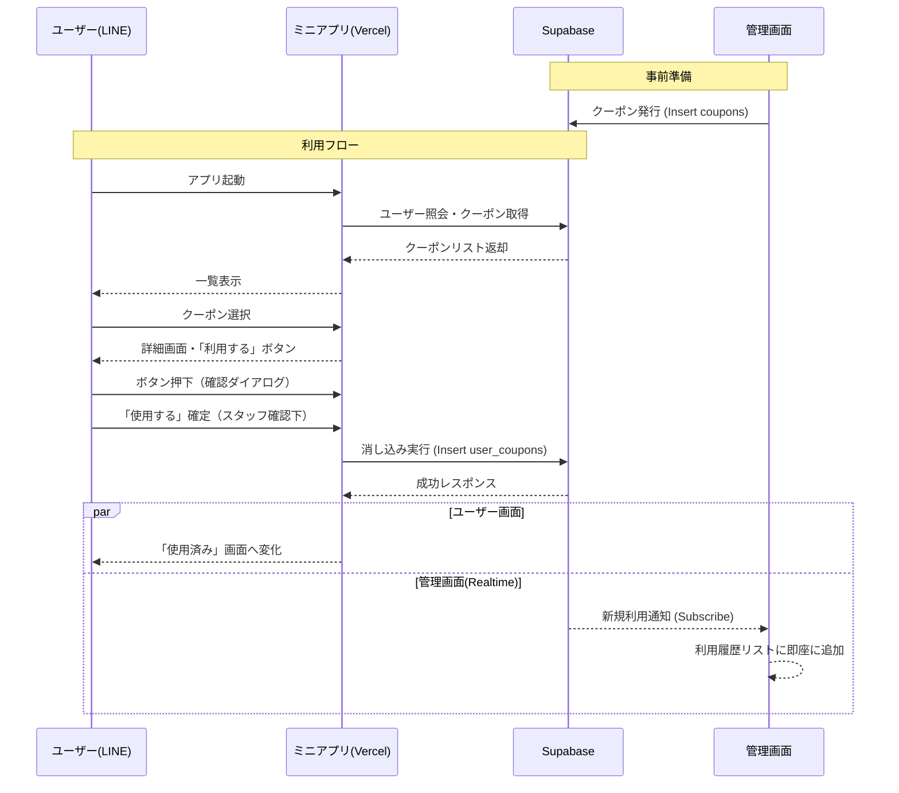

# LINEミニアプリ「クーポン機能」プロトタイプ要件定義書

## 1\. システム概要

LINEミニアプリ上で動作するデジタルクーポンシステム。店舗管理者が発行したクーポンを、ユーザーがLINE上で取得・利用（消し込み）できる。

### 1.1 技術スタック

  * **Frontend (Admin & Mini App):** Next.js (App Router推奨)
  * **Infrastructure:** Vercel
  * **Backend / Database:** Supabase
  * **Platform:** LINE Front-end Framework (LIFF)

## 2\. データベース設計 (Supabase)

プロトタイプとして必要最小限、かつ管理しやすい構成にします。

### テーブル構成

#### 1\. `coupons` （クーポンマスタ）

管理者が作成するクーポンの情報を管理します。
| カラム名 | データ型 | 説明 |
| :--- | :--- | :--- |
| `id` | uuid | プライマリキー |
| `title` | text | クーポン名（例：1ドリンク無料） |
| `description` | text | 注意書き・詳細 |
| `image_url` | text | クーポン画像のURL (Supabase Storage) |
| `valid_from` | timestamptz | 有効期間（開始） |
| `valid_to` | timestamptz | 有効期間（終了） |
| `is_active` | boolean | 公開/非公開フラグ |
| `usage_limit` | integer | 利用回数制限（例：1回のみ、無制限など） |

#### 2\. `users` （ユーザー管理）

LINEユーザー情報を格納します。
| カラム名 | データ型 | 説明 |
| :--- | :--- | :--- |
| `id` | text | LINE User ID (sub) をPKとして使用 |
| `display_name`| text | LINE表示名 |
| `avatar_url` | text | アイコン画像 |
| `created_at` | timestamptz | 初回アクセス日時 |

#### 3\. `user_coupons` （消し込み履歴・トランザクション）

誰がどのクーポンをいつ使ったかを記録します。
| カラム名 | データ型 | 説明 |
| :--- | :--- | :--- |
| `id` | uuid | プライマリキー |
| `user_id` | text | `users.id` への外部キー |
| `coupon_id` | uuid | `coupons.id` への外部キー |
| `used_at` | timestamptz | 使用日時（NULLなら未使用） |
| `status` | text | ステータス ('used', 'unused') |

-----

## 3\. 機能要件：管理画面 (Admin)

PCまたはタブレットでの操作を想定します。

### 3.1 認証機能

  * **管理者ログイン:** Supabase Auth (Email/Password) を使用。
      * 一般ユーザーが入れないよう、特定のメールアドレスのみ許可、またはRLS（Row Level Security）で制御。

### 3.2 クーポン管理機能

  * **クーポン一覧表示:** 作成済みクーポンの一覧とステータス表示。
  * **クーポン作成・編集:**
      * タイトル、説明文、有効期限の設定。
      * 画像のアップロード機能 (Supabase Storageへ保存)。

### 3.3 消し込み確認 (リアルタイム更新)

  * **利用履歴一覧:** ユーザーがクーポンを使用した履歴を表示（日時、ユーザー名、クーポン名）。
  * **リアルタイム反映:** SupabaseのRealtime機能を使用し、ユーザーが手元で「もぎり」をした瞬間、管理画面のリストが自動更新されるようにする（リロード不要）。

-----

## 4\. 機能要件：ユーザー側 (LINEミニアプリ)

スマートフォン（LINE内ブラウザ）での操作を想定します。

### 4.1 認証・初期化

  * **LIFF初期化:** アプリ起動時にLIFF SDKを初期化。
  * **会員登録（自動）:** `liff.getProfile()` でLINEユーザーIDを取得し、Supabaseの `users` テーブルに存在しなければ新規登録、あればログイン扱いとする。

### 4.2 クーポン一覧画面

  * **表示ロジック:**
      * 現在有効なクーポン（`coupons` テーブル）を表示。
      * 「使用済み」または「期限切れ」のものはグレーアウト、あるいは「使用済みタブ」に分ける。

### 4.3 クーポン詳細・もぎり画面 (Core Feature)

  * **UI表示:** クーポン画像、タイトル、詳細を大きく表示。
  * **もぎりアクション (重要):**
    1.  画面下部に「クーポンを利用する」ボタンを配置。
    2.  **誤操作防止:** ボタン押下後、\*\*「スタッフにこの画面を見せてください」\*\*という確認モーダルを表示。
    3.  **消し込み実行:** ユーザー（またはスタッフ）がモーダル内の「使用する」をタップ。
    4.  **完了演出:** 画面上でチケットがちぎれるアニメーション、または「使用済み」スタンプが押されるアニメーションを表示。
    5.  **データ更新:** API経由で `user_coupons` にレコードを追加（または更新）。

-----

## 5\. UI/UX フローチャート案

## 6\. 開発における注意点・非機能要件

1.  **セキュリティ (RLS):**
      * SupabaseのRLS（Row Level Security）を必ず設定する。
      * `coupons` テーブル: 誰でも閲覧可能 (`SELECT`)、編集は管理者のみ。
      * `user_coupons` テーブル: ユーザーは自分のデータのみ `INSERT/SELECT` 可能。
2.  **UX（もぎり体験）:**
      * 「一度消し込むと元に戻せない」ことをユーザーに直感的に伝えるUIにする必要があります（スライドバー形式にするなど、タップ一発で消えない工夫も有効です）。
3.  **LINE審査基準:**
      * プロトタイプとはいえ、LINEミニアプリのガイドラインに沿って、「LINEのロード画面」などを適切に配置する必要があります。
